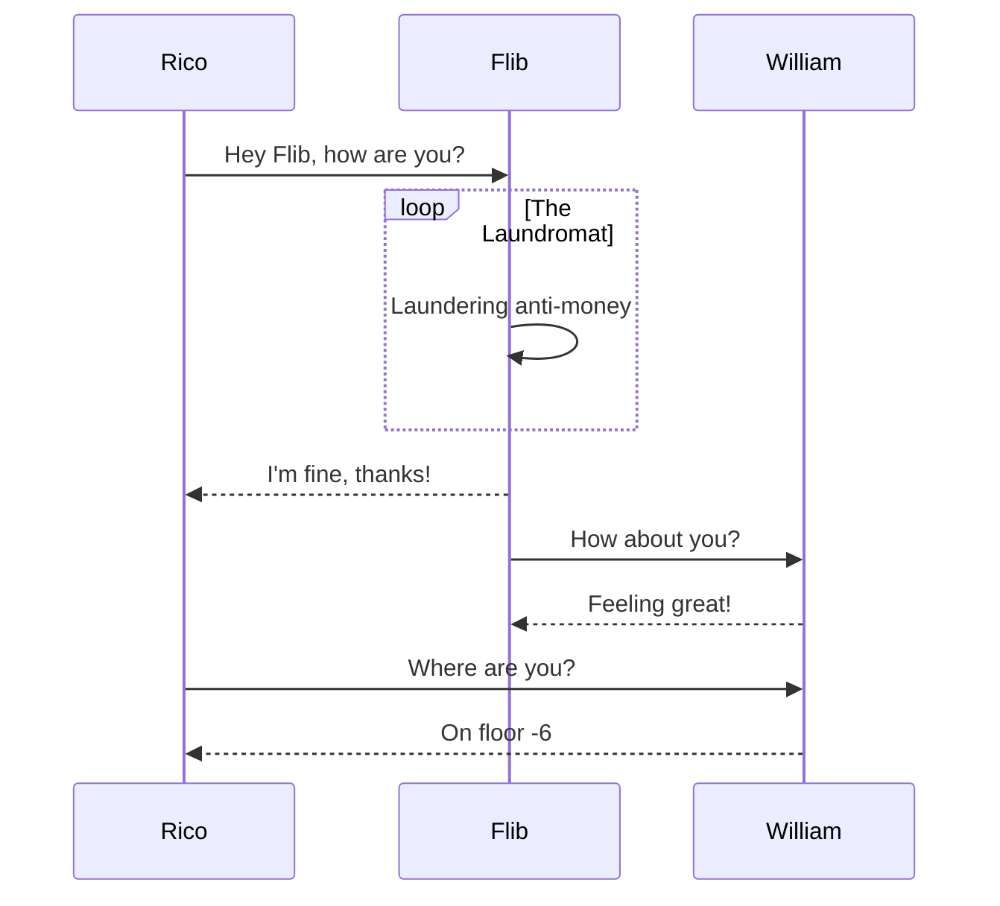

---
{
  "type": "portfolio",
  "date": "2019-02-01 03:00:00 -0400",
  "shortTitle": "Motion Graphic",
  "client": "Hogeschool van Arnhem en Nijmegen",
  "category": "Bisschop Hamer",
  "tags": [
    "animation",
    "motion graphic"
  ],
  "images": {
    "featured": {
      "filename": "man-drawing-something.webp",
      "description": ""
    }
  },
  "permalink": "/portfolio/motion-graphic-bisschop-hamer",
  "lang": "nl",
  "excerpt": "Animatiefilmpje over het leven van Bisschop Hamer"
}
---

# Animatie: Bisschop Hamer

Ik maak zo af en toe illustraties in Adobe Illustrator, bijvoorbeeld om een verhaal te vertellen of iets toe te lichten. Als opdracht van de HAN heb ik een storyboard gemaakt over het leven van Bisschop Hamer, om er  vervolgens een animatie van te maken.


## Het proces

Graag vertel ik iets over het proces van animeren.




### Script

Om een animatie te maken is het verstandig om eerst te brainstormen en aan de hand van de ideeën een script te schrijven. Dit script bevat het verhaal dat je wil vertellen en beschrijft daarnaast ook wat er in beeld komt. Aan de hand van de tekst uit het script kun je dan een voice-over opnemen, waarmee je kunt toetsen of het verhaal in zijn geheel duidelijk is. Daarnaast geeft de voice-over ritme aan je verhaal.

Bij een script voor een animatie maak ik zelf onderscheid tussen de gesproken tekst (`VOICE-OVER`), het beeld en de acties die te zien zijn (`BEELD`), de geluidseffecten (`SOUND FX`) en muziek (`MUZIEK`). Indien er meerdere stemmen zijn, gebruik ik de naam van de spreker in plaats van `VOICE-OVER`.

```
VOICE-OVER    Bisschop Hamer is geboren in de oudste stad van Nederland,
              dat vroeger het gebied van de Bataven was.
              
BEELD         Wereldbol verschijnt, er wordt ingezoomd op Nederland
              Bezette gebieden van de Chamaven, Bataven, Friezen etc.
              worden getoond. Er wordt nadruk gelegd op het gebied van de Bataven.


VOICE-OVER    Hamer groeide op met de scheutisten
              en voor zijn werk als missiepioneer reisde hij al op 25-jarige leeftijd
              de hele wereld over.
              
BEELD         Wereldbol verschijnt weer. Een route wordt uitgestippeld
              die China doorkruist.


VOICE-OVER    Er kwam een abrupt einde aan zijn leven,
              toen hij op een brute wijze vermoord werd.
              
BEELD         Vogels vliegen uit de bomen. Guillotine komt in beeld,
              er kleeft bloed aan.
              
SOUND FX      Een man schreeuwt voor zijn leven.
              Geluid van twee, over elkaar schapende messen.


VOICE-OVER    Om zijn werk te herdenken is er geld ingezameld.
              Met dit geld is er een standbeeld opgericht ter nagedachtenis
              aan de bisschop.
              
BEELD         Munten worden op een berg geld gegooid. De berg geld verandert in
              een schaduw van het standbeeld.
              
SOUND FX      Munten die op elkaar gegooid worden. Plopje.


VOICE-OVER    Het standbeeld van Bisschop Hamer staat vandaag de dag
              nog steeds op dezelfde plek... Kun jij vertellen waar het zich bevindt?
              
BEELD         Kaart van Nederland verschijnt. Er worden vraagtekens gezet.
              
SOUND FX      Plopjes.
```

### Storyboards

Op basis van de informatie uit het script wordt er vervolgens een storyboard gemaakt. Dit gebeurt in twee fasen: low-end en high-end. Een low-end storyboard wordt doorgaans gemaakt op papier, met een potlood en gum. Door te schetsen is het makkelijker om fouten te herstellen en de shots aan te sluiten op de verhaallijn. Soms worden er voor een animatie ook meerdere low-end storyboards gemaakt, bijvoorbeeld als je in groepsverband werkt. Dan kun je elkaars resultaat vergelijken en het geheel combineren tot iets moois.

<!-- TODO: Low-end Storyboard tonen -->

Aan de hand van de schetsen uit de low-end storyboard wordt er een high-end storyboard gemaakt. Dit houdt in dat er (digitale) illustraties ontstaan van een veel hoger niveau.

### Animeren

Vervolgens worden de illustraties omgezet tot een animatie, waarbij het ritme van de voice-over gecombineerd met het storyboard de tijd en verloop van de animatie bepalen. Omdat het high-end storyboard al het grootste deel van de illustraties bevat is animeren zo gedaan.

<!-- TODO: Adobe After Effects tonen -->